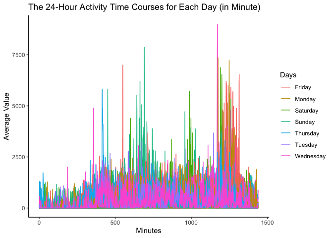

P8105 - Homework 3
================
Mingkuan Xu

``` r
library(tidyverse)
library(p8105.datasets)
```

## Problem 1

#### Part 1 - Data import & description

``` r
data("instacart")
head(instacart)
```

    ## # A tibble: 6 × 15
    ##   order_id product_id add_to_cart_order reordered user_id eval_set order_number
    ##      <int>      <int>             <int>     <int>   <int> <chr>           <int>
    ## 1        1      49302                 1         1  112108 train               4
    ## 2        1      11109                 2         1  112108 train               4
    ## 3        1      10246                 3         0  112108 train               4
    ## 4        1      49683                 4         0  112108 train               4
    ## 5        1      43633                 5         1  112108 train               4
    ## 6        1      13176                 6         0  112108 train               4
    ## # … with 8 more variables: order_dow <int>, order_hour_of_day <int>,
    ## #   days_since_prior_order <int>, product_name <chr>, aisle_id <int>,
    ## #   department_id <int>, aisle <chr>, department <chr>

This is an anonymized dataset recording online grocery orders from
Instacart users. Each row in the dataset is a product from an order;
there is a single order per user in this dataset. There are 1384617
total rows in this dataset with 15 columns, recording 131209 orders in
total. The recorded information include: order id, product id, add to
cart order, reordered, user id, eval set, order number, order dow, order
hour of day, days since prior order, product name, aisle id, department
id, aisle, department. There are some interesting observations of this
dataset. For example, there are 21 departments in total, including dairy
eggs, produce, canned goods, beverages, deli, snacks, pantry, frozen,
meat seafood, household, bakery, personal care, dry goods pasta, babies,
missing, other, breakfast, international, alcohol, bulk, pets.

#### Part 2 - Analysis of aisles

``` r
instacart %>% pull(aisle) %>% unique() %>% length() # Find number of aisles.
```

    ## [1] 134

``` r
instacart_by_aisle = 
  instacart %>% 
  count(aisle) %>% 
  arrange(desc(n)) 

head(instacart_by_aisle,1)# Find most popular aisle
```

    ## # A tibble: 1 × 2
    ##   aisle                 n
    ##   <chr>             <int>
    ## 1 fresh vegetables 150609

Using the codes above, we found that there are 134 aisles in total, with
aisle of the fresh vegetables being the most popular one from which
150609 items were ordered.

#### Part 3 - Plot of items from aisles.

Now we plot the number of items ordered in each aisle, limiting this to
aisles with more than 10000 items ordered using the following code.

``` r
instacart_by_aisle %>% 
  filter(n>10000)  %>%
  ggplot(.,aes(x=reorder(aisle,n),y=n)) + 
  geom_bar(stat="identity") +
  xlab("Aisle")+
  ylab("Number of Items") +
  coord_flip()+
  theme_classic()
```

<!-- -->

#### Part 4 - Three most popular items

Using the code below, we display the table showing the three most
popular items in each of the aisles “baking ingredients”, “dog food
care”, and “packaged vegetables fruits”.

``` r
baking_ingredients = 
  instacart %>%
  filter(aisle=="baking ingredients") %>%
  count(product_name) %>%
  arrange(desc(n)) %>%
  mutate(Aisle="Baking Ingredients") %>%
  rename(Product=product_name,Count=n)%>%
  relocate(Aisle) %>%
  head(3)
  

dog_food_care = 
  instacart %>%
  filter(aisle=="dog food care") %>%
  count(product_name) %>%
  arrange(desc(n)) %>%
  mutate(Aisle="Dog Food Care") %>%
  rename(Product=product_name,Count=n)%>%
  relocate(Aisle) %>%
  head(3)

packaged_vegetables_fruits = 
  instacart %>%
  filter(aisle=="packaged vegetables fruits") %>%
  count(product_name) %>%
  arrange(desc(n)) %>%
  mutate(Aisle="Packaged Vegetables Fruits") %>%
  rename(Product=product_name,Count=n)%>%
  relocate(Aisle) %>%
  head(3)

popular_table = 
  bind_rows(baking_ingredients,
                          dog_food_care,
                          packaged_vegetables_fruits) %>%
  arrange(desc(Count))

popular_table %>% knitr::kable(digits = 1)
```

| Aisle                      | Product                                       | Count |
|:---------------------------|:----------------------------------------------|------:|
| Packaged Vegetables Fruits | Organic Baby Spinach                          |  9784 |
| Packaged Vegetables Fruits | Organic Raspberries                           |  5546 |
| Packaged Vegetables Fruits | Organic Blueberries                           |  4966 |
| Baking Ingredients         | Light Brown Sugar                             |   499 |
| Baking Ingredients         | Pure Baking Soda                              |   387 |
| Baking Ingredients         | Cane Sugar                                    |   336 |
| Dog Food Care              | Snack Sticks Chicken & Rice Recipe Dog Treats |    30 |
| Dog Food Care              | Organix Chicken & Brown Rice Recipe           |    28 |
| Dog Food Care              | Small Dog Biscuits                            |    26 |

#### Part 5 - The mean hour of the day

Using the codes below, we display the table showing the mean hour of the
day at which Pink Lady Apples and Coffee Ice Cream are ordered, from
Sunday to Saturday.

``` r
pink_lady_apples = 
  instacart %>%
  filter(product_name == "Pink Lady Apples") %>%
  select(order_dow,order_hour_of_day) %>%
  group_by(order_dow) %>%
  summarize(
    median_hour_of_day = mean(order_hour_of_day)
  ) %>%
  rename("Pink Lady Apples"=median_hour_of_day)


coffee_ice_cream = 
  instacart %>%
  filter(product_name == "Coffee Ice Cream") %>%
  select(order_dow,order_hour_of_day) %>%
  group_by(order_dow) %>%
  summarize(
    median_hour_of_day = mean(order_hour_of_day)
  ) %>%
  rename("Coffee Ice Cream"=median_hour_of_day)

median_hour_table = 
  left_join(pink_lady_apples,coffee_ice_cream,by="order_dow") %>%
  select(-order_dow)
# mutate("Day of Week" = c("Sunday","Monday","Tuesday","Wednesday","Thursday","Friday","Saturday"))

median_hour_table %>% knitr::kable(digits = 1)
```

| Pink Lady Apples | Coffee Ice Cream |
|-----------------:|-----------------:|
|             13.4 |             13.8 |
|             11.4 |             14.3 |
|             11.7 |             15.4 |
|             14.2 |             15.3 |
|             11.6 |             15.2 |
|             12.8 |             12.3 |
|             11.9 |             13.8 |

## Problem 2

#### Part 1 - Data preprocessing

We start by using the following codes to tide up the dataset.

``` r
data("brfss_smart2010")

data_brfss = brfss_smart2010 %>%
  janitor::clean_names() %>% 
  filter(topic=="Overall Health") %>%
  filter(response %in% c("Excellent","Very good","Good","Fair","Poor")) %>%
  mutate(response = factor(response,levels = c("Poor","Fair","Good","Very good","Excellent")))

head(data_brfss) 
```

    ## # A tibble: 6 × 23
    ##    year locationabbr locationdesc  class  topic  question   response sample_size
    ##   <int> <chr>        <chr>         <chr>  <chr>  <chr>      <fct>          <int>
    ## 1  2010 AL           AL - Jeffers… Healt… Overa… How is yo… Excelle…          94
    ## 2  2010 AL           AL - Jeffers… Healt… Overa… How is yo… Very go…         148
    ## 3  2010 AL           AL - Jeffers… Healt… Overa… How is yo… Good             208
    ## 4  2010 AL           AL - Jeffers… Healt… Overa… How is yo… Fair             107
    ## 5  2010 AL           AL - Jeffers… Healt… Overa… How is yo… Poor              45
    ## 6  2010 AL           AL - Mobile … Healt… Overa… How is yo… Excelle…          91
    ## # … with 15 more variables: data_value <dbl>, confidence_limit_low <dbl>,
    ## #   confidence_limit_high <dbl>, display_order <int>, data_value_unit <chr>,
    ## #   data_value_type <chr>, data_value_footnote_symbol <chr>,
    ## #   data_value_footnote <chr>, data_source <chr>, class_id <chr>,
    ## #   topic_id <chr>, location_id <chr>, question_id <chr>, respid <chr>,
    ## #   geo_location <chr>

#### Part 2 - Which states were observed at 7 or more locations?

``` r
data_brfss_2002 = 
  data_brfss %>%
  filter(year==2002) %>%
  select(locationabbr,locationdesc) %>%
  distinct() %>%
  count(locationabbr) %>%
  filter(n>=7)

data_brfss_2010 = 
  data_brfss %>%
  filter(year==2010) %>%
  select(locationabbr,locationdesc) %>%
  distinct() %>%
  count(locationabbr) %>%
  filter(n>=7)
```

We use the above code o find out which states were observed at 7 or more
locations in 2002 and 2010. In conclusion, in 2002, the abbreviated
names of those states are CT, FL, MA, NC, NJ, PA; in 2010, those states
are CA, CO, FL, MA, MD, NC, NE, NJ, NY, OH, PA, SC, TX, WA. We observed
significantly more locations recorded in 2010 compared with 2002.

#### Part 3 - The “spaghetti” plot

``` r
data_brfss_excellent = 
  data_brfss %>%
  filter(response=="Excellent") %>%
  drop_na(data_value) %>%
  group_by(year,locationabbr) %>%
  summarize(
    mean_value = mean(data_value)
  ) 
ggplot(data_brfss_excellent,aes(x=year,y=mean_value,color=locationabbr)) + 
  geom_line() +
  geom_point() +
  labs(
    title = "The “Spaghetti” Plot of Excellent Responses (2002~2010)",
    color = "States") +
  ylab("Mean Value")+
  xlab("Year")+
  theme_classic()
```

<!-- -->

#### Part 4 - The two-panel plot of NY

``` r
data_ny_2006_2010 = 
  data_brfss %>%
  filter(year %in% c(2006,2010),locationabbr=="NY") %>%
  select(year,locationdesc,data_value,response) %>%
  drop_na(data_value)

data_ny_2006_2010 %>%
  ggplot(aes(x=locationdesc,y=data_value)) + 
  geom_bar(aes(fill=response),stat="identity") +
  facet_grid(. ~ year) + 
  coord_flip() +
  theme(legend.position = "bottom") +
  xlab("Data Values")+
  ylab("Locations")+
  labs(title = "A Two-Panel Plot of Responses in NY (2006 vs 2010)")+
  theme_classic()
```

<!-- --> ## Problem
3

#### Part 1 - Data preprocessing

``` r
# Import data from the csv file. 
data_accel = 
  read_csv("./data/accel_data.csv") %>%
  janitor::clean_names() %>%
  mutate(is_weekday=
           ifelse(day %in% c("Saturday","Sunday"),
                  FALSE,
                  TRUE)) %>% # A column to record if it is weekday.
  relocate(week,day_id,day,is_weekday)
```

    ## Rows: 35 Columns: 1443

    ## ── Column specification ────────────────────────────────────────────────────────
    ## Delimiter: ","
    ## chr    (1): day
    ## dbl (1442): week, day_id, activity.1, activity.2, activity.3, activity.4, ac...

    ## 
    ## ℹ Use `spec()` to retrieve the full column specification for this data.
    ## ℹ Specify the column types or set `show_col_types = FALSE` to quiet this message.

``` r
head(data_accel)
```

    ## # A tibble: 6 × 1,444
    ##    week day_id day      is_weekday activity_1 activity_2 activity_3 activity_4
    ##   <dbl>  <dbl> <chr>    <lgl>           <dbl>      <dbl>      <dbl>      <dbl>
    ## 1     1      1 Friday   TRUE             88.4       82.2       64.4       70.0
    ## 2     1      2 Monday   TRUE              1          1          1          1  
    ## 3     1      3 Saturday FALSE             1          1          1          1  
    ## 4     1      4 Sunday   FALSE             1          1          1          1  
    ## 5     1      5 Thursday TRUE             47.4       48.8       46.9       35.8
    ## 6     1      6 Tuesday  TRUE             64.8       59.5       73.7       45.7
    ## # … with 1,436 more variables: activity_5 <dbl>, activity_6 <dbl>,
    ## #   activity_7 <dbl>, activity_8 <dbl>, activity_9 <dbl>, activity_10 <dbl>,
    ## #   activity_11 <dbl>, activity_12 <dbl>, activity_13 <dbl>, activity_14 <dbl>,
    ## #   activity_15 <dbl>, activity_16 <dbl>, activity_17 <dbl>, activity_18 <dbl>,
    ## #   activity_19 <dbl>, activity_20 <dbl>, activity_21 <dbl>, activity_22 <dbl>,
    ## #   activity_23 <dbl>, activity_24 <dbl>, activity_25 <dbl>, activity_26 <dbl>,
    ## #   activity_27 <dbl>, activity_28 <dbl>, activity_29 <dbl>, …

This dataset contains the five weeks of accelerometer data collected on
a 63 year-old male with BMI 25. It records 35 days in total; for each
day, it contains the values of 1440 activities. Aside from the
accelerometer data, it also contains week, day_id, day, is_weekday for
each row.

#### Part 2 - Aggregate accross minutes

``` r
# Import data from the csv file. 
data_accel_wholeday = 
  data_accel %>%
  rowwise() %>%
  mutate(activity_total = sum(across(activity_1:activity_1440))) %>%
  ungroup() %>%
  select(day_id,is_weekday,activity_total) 

data_accel_wholeday %>% knitr::kable(digits = 1)
```

| day_id | is_weekday | activity_total |
|-------:|:-----------|---------------:|
|      1 | TRUE       |       480542.6 |
|      2 | TRUE       |        78828.1 |
|      3 | FALSE      |       376254.0 |
|      4 | FALSE      |       631105.0 |
|      5 | TRUE       |       355923.6 |
|      6 | TRUE       |       307094.2 |
|      7 | TRUE       |       340115.0 |
|      8 | TRUE       |       568839.0 |
|      9 | TRUE       |       295431.0 |
|     10 | FALSE      |       607175.0 |
|     11 | FALSE      |       422018.0 |
|     12 | TRUE       |       474048.0 |
|     13 | TRUE       |       423245.0 |
|     14 | TRUE       |       440962.0 |
|     15 | TRUE       |       467420.0 |
|     16 | TRUE       |       685910.0 |
|     17 | FALSE      |       382928.0 |
|     18 | FALSE      |       467052.0 |
|     19 | TRUE       |       371230.0 |
|     20 | TRUE       |       381507.0 |
|     21 | TRUE       |       468869.0 |
|     22 | TRUE       |       154049.0 |
|     23 | TRUE       |       409450.0 |
|     24 | FALSE      |         1440.0 |
|     25 | FALSE      |       260617.0 |
|     26 | TRUE       |       340291.0 |
|     27 | TRUE       |       319568.0 |
|     28 | TRUE       |       434460.0 |
|     29 | TRUE       |       620860.0 |
|     30 | TRUE       |       389080.0 |
|     31 | FALSE      |         1440.0 |
|     32 | FALSE      |       138421.0 |
|     33 | TRUE       |       549658.0 |
|     34 | TRUE       |       367824.0 |
|     35 | TRUE       |       445366.0 |

``` r
ggplot(data_accel_wholeday,aes(x=day_id,y=activity_total)) + 
  geom_line()+
  geom_point(aes(color=is_weekday))+
  theme_bw()+
  xlab("Days")+
  ylab("Activity Total")+
  labs(color="is_weekday")
```

<!-- --> From the
data of aggregated total activity, we do not find a trend of overall
decreasing or increasing, but we do observe the total values are very
unstable from the beginning to the end, with huge variance between days.
Additionally, when taking into account the weekday/weekend variable, it
looks like after day 20, on each Saturday there will be a huge decrease
of the value.

#### Part 3 - The 24-hour activity time courses for each day

``` r
data_accel_long = data_accel %>% 
  pivot_longer(activity_1:activity_1440,names_to="activity",names_prefix = "activity_") %>%
  mutate(activity = as.numeric(activity))

ggplot(data_accel_long, aes(x=activity,y=value,group=day_id)) + 
  geom_line(aes(color=day))+
  ylab("Average Value")+
  xlab("Minutes")+
  labs(
    title = "The 24-Hour Activity Time Courses for Each Day (in Minute)",
    color = "Days"
  )+
  theme_classic()
```

<!-- -->

``` r
data_accel_long_60 = data_accel %>% 
  pivot_longer(activity_1:activity_1440,names_to="activity",names_prefix = "activity_") %>%
  mutate(hour = as.numeric(activity) %/% 60) %>%
  group_by(day_id,day,hour) %>%
  summarize(
    average = mean(value)
  )
```

    ## `summarise()` has grouped output by 'day_id', 'day'. You can override using the `.groups` argument.

``` r
ggplot(data_accel_long_60, aes(x=hour,y=average,group=day_id)) + 
  geom_line(aes(color=day))+
  ylab("Average Value")+
  xlab("Hours")+
  labs(
    title = "The 24-Hour Activity Time Courses for Each Day (in Hour)",
    color = "Days"
  )+
  theme_classic()
```

<!-- -->

From these two plots, we observe that the values tend to stay in a lower
level in the morning, and begin to increase at around 5 am (possibly
after getting up) and reach a high level at noon. The values seem to
decrease in the afternoon and bounce back in the evening. They drop back
to a lower level usually at the end of the day. No obvious patterns
related to days were observed.
